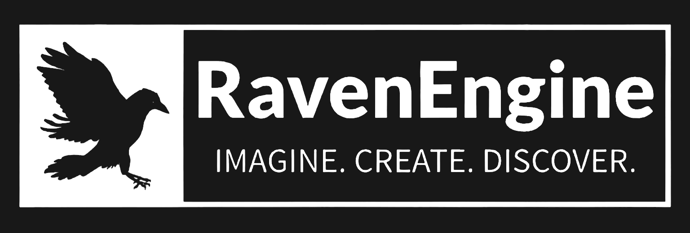

# RavenEngine

RavenEngine is a cutting-edge game engine designed to provide a comprehensive and user-friendly platform for game development. Primarily built in C++, our engine focuses on delivering top-notch performance, ease of use, and flexibility for both 2D and 3D game development.

## Overview

RavenEngine aims to bridge the gap between ambitious game design and practical development solutions. By leveraging advanced technologies such as OpenGL and GLFW for rendering and window management, we provide developers with the tools needed to bring their creative visions to life.

## Key Features

- **Efficient Window Management**: Utilizing GLFW for seamless creation and handling of game windows.
- **Robust Rendering System**: Support for both 2D and 3D graphics, with an emphasis on performance and visual fidelity.
- **Intuitive Input Handling**: A comprehensive system for capturing and processing player interactions.
- **Dynamic UI/UX**: Creating user interfaces that are both functional and visually appealing.
- **Advanced Asset Management**: Efficient handling of game assets like textures, models, and sounds.
- **Immersive Audio Engine**: High-quality audio integration for an enveloping game experience.
- **Flexible Animation Tools**: Simplifying the creation and management of complex animations.
- **Innovative Utilities**: Tools designed to boost productivity, including a Documentation Builder and Checklist Maker.

## Getting Started

coming soon...

## Development Roadmap

Our journey is ongoing, and we have big plans for RavenEngine. Development Roadmap coming soon...

## Contributing

We welcome contributions from passionate developers and creatives. For details on how to contribute, please read our [Contribution Guidelines](https://github.com/Maefreric/RavenEngine/blob/main/CONTRIBUTING.md).

## License

RavenEngine is licensed under the [MIT License](https://github.com/Maefreric/RavenEngine/blob/main/LICENSE). Feel free to explore, modify, and distribute the engine as you see fit.

## Contact Us

Have questions or suggestions? Reach out to us by [opening an issue](LINK-TO-ISSUES) on GitHub or via our [contact page](LINK-TO-CONTACT-PAGE).

We look forward to seeing the incredible games you'll create with RavenEngine!
